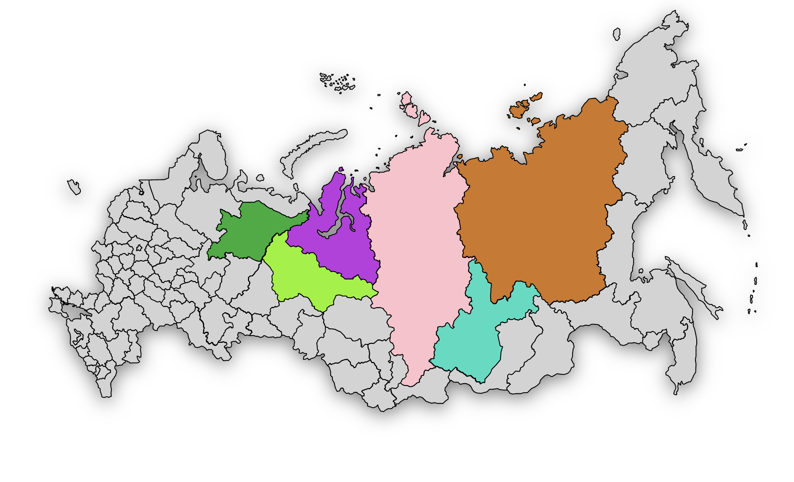

# Интерактивная карта с историческими данными



Этот проект представляет собой интерактивную карту, позволяющую исследовать исторические данные о различных регионах. Карта позволяет получать информацию о населении, площади и интересных фактах о конкретных местоположениях.

Потыкать можно [здесь](ссылка)

## О проекте

### Цель проекта
Цель данного проекта - создать интерактивную карту для представления исторических данных о регионах, удобную для образовательных и исследовательских целей.

### Ключевые особенности
- **Интерактивность:** Пользователи могут кликнуть на регион, чтобы увидеть подробные исторические данные о выбранном местоположении.
- **Динамическое создание попап окон:** Каждое попап окно создается динамически, отображая информацию о регионе на основе данных.
- **Отзывчивый интерфейс:** Адаптивный дизайн для удобства использования на различных устройствах.

## Использованные технологии

- HTML, CSS, JavaScript для разработки интерфейса и функциональности карты.
- SVG-формат для отображения карты.

## Установка и запуск проекта

1. Склонируйте репозиторий на свой локальный компьютер (git clone https://github.com/astra463/russian_map.git)
2. Откройте файл index.html в вашем веб-браузере.

## Пример использования

```javascript
// Пример использованного кода для открытия попап окна по клику на элемент интерфейса
popupButtons.forEach(button => {
    button.addEventListener('click', function(event) {
        const key = event.currentTarget.getAttribute('data-key');
        popupContainer.appendChild(createPopup(regionData, deleteCard, key));
        document.querySelector('.popup').classList.add('active');
    })
});
