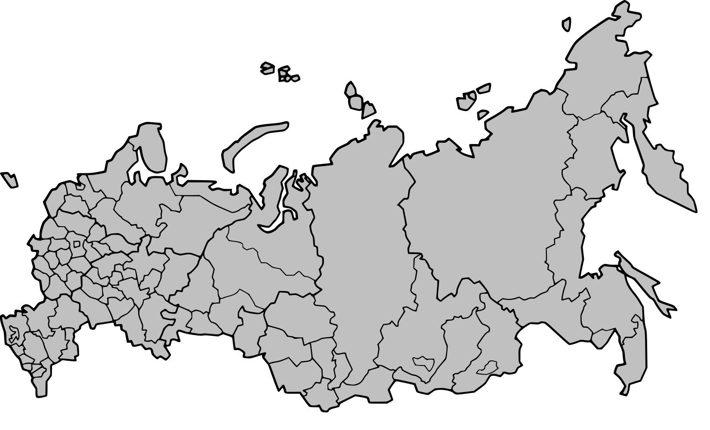
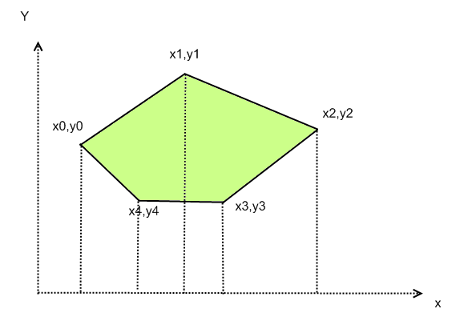
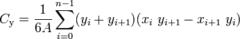
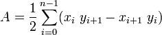

## Интерактивная карта регионов РФ
## Входные данные
Из внешних данных понадобиться только карта России разделенная на регионы. Общепринятый формат для карт это GIS который включает в себя карту в векторном формате. Перенесём эту карту в формат svg так как это лучший способ сделать интерактивный векторный объект. Я возьму готовый файл в Интернете.
## Как записан регион в svg файле

Регион на карте - это многоугольник (полигон). Информация о том, как его нарисовать записана в атрибутах path. Например, Белгородская область внутри файла записана так:
```xml
<path
   id="BelgorodOblast"
   d="M 99.9,675.5 C 99.2,674.7 98.1,669.1 97.5,663.1 C 96.9,657 95.9,651.7 95.4,651.2 C 94.8,650.7 92.2,649.5 89.6,648.5 C 85.6,647.1 84.1,645.7 81.2,641.2 C 77.9,636 77.8,635.5 78.9,631.8 C 79.5,629.7 80.6,627.7 81.3,627.5 C 83.3,626.7 90.6,629.8 95.6,633.5 C 98.7,635.9 101.3,637.1 103.5,637.1 C 106.2,637.1 107.4,637.9 110.3,641.4 C 113.6,645.4 113.9,646.3 113.9,652.2 C 113.8,661.8 112.6,665.6 107.8,671 C 102.6,676.8 101.4,677.4 99.9,675.5 Z"
   style="fill:#c0c0c0;fill-opacity:1"
   class="state" />
```
Атрибут **d** это набор команд как рисовать фигуру. Если перевести её на русский язык, то получится: поставь карандаш в точку *99.9,675.5*, проведи её в точку *97.5,663.1*, так множество раз, далее доведи карандаш до начальной точки.
Поэтому зная значение атрибута d у региона мы можем получить все точки полигона и, соответственно его площадь и центр.

### Как добавить карту на веб-страницу
Вставив объект
```html
<object type="image/svg+xml" data="map.svg" id="map">
  There should be a map of Russian states
</object>
```
### Обработка наведения курсора
```JavaScript
  const mapObject = document.querySelector('#map')
  mapObject.addEventListener('load', () => {
    const svg = mapObject.contentDocument
    const states = svg.querySelectorAll('.state') 
    states.forEach((state, i) => {
      state.addEventListener('mouseenter', (event) => {
        console.log(event)
      })
    })
  })
```

### Алгоритм нахождения площади

Сложим площади трапеций и найдем площадь всей фигуры.
```JavaScript
const iter = makeIter()
let area = 0;
while(!iter.done){
  const {x1, y1, x2, y2} = iter.next()
  area += y1+y2 * (x2-x1) / 2
}
```

### Алгоритм поиска геометрического центра (центроида) 
<br>


## Proof of concept
[Демосайт](https://maxxxpavlov.github.io/russian-map/)
<br/>
Вот и все, время:
01:55:00


## Как добавить элемент в центр региона
Надо лишь добавить желаемый элемент в svg и при ховере уровнять его координаты с координатами центра.